Exploration for Website (Clean Up)
================
Ashley Kang
12/3/2018

### Datasets

Asthma Datasets:
----------------

-   Children's Asthma Hospitalization Rate for NYC, 2012-14

``` r
asthma_hosp_child_nyc = read_csv("./data_website/asthma_hospitalization_rate_10000_children.csv") %>%
  janitor::clean_names() %>%
  filter(health_topic %in% "Respiratory Disease Indicators") %>% 
  filter(county_name == "Bronx" | county_name == "Kings" | county_name == "Queens" | county_name == "Richmond" | county_name == "New York") %>%
  select(county_name, percent_rate, data_years) %>%
  rename(asthma_hosp_percent_rate = percent_rate, 
         asthma_hosp_years = data_years)
```

-   Asthma Hospitalization Rate for NYC, 2012-2014

``` r
asthma_hosp_nyc = read_csv("./data_website/asthma_ED_rate_10000.csv") %>%
  janitor::clean_names() %>%
  filter(county_name %in% c("Bronx", "Kings", "Queens", "Richmond", "New York City")) %>% 
  select(county_name, percentage_rate_ratio, data_years) %>%
  rename(asthma_hosp_percent_rate_ratio = percentage_rate_ratio, 
         asthma_hosp_years = data_years)
```

-   Asthma ER Admissions Rate Dataset, 2014

``` r
asthma_ER_2014 = read_csv("./data_website/Asthma_ER_Rate_10000.csv") %>%
  janitor::clean_names() %>%
  #filter(county_name == "Bronx" | county_name == "Kings" | county_name == "Queens" | county_name == "Richmond" | county_name == "New York") %>%
  select(county_name, percentage_rate_ratio, data_years) %>%
  rename(asthma_ER_percent_rate = percentage_rate_ratio, 
         asthma_ER_years = data_years) %>%
  filter(county_name != "Long Island" & county_name != "New York City" & county_name != "Mid-Hudson" & county_name != "Capital Region" & county_name != "Mohawk Valley" & county_name != "North Country" & county_name != "Tug Hill Seaway" & county_name != "Central NY" & county_name != "Southern Tier" & county_name != "Finger Lakes" & county_name != "Western NY" & county_name != "New York State (excluding NYC)" & county_name != "New York State") %>% #to remove non-county regions
  rename(county = county_name)
```

CVD Datasets:
-------------

-   Age-Adjusted Cardiovascular Hospitalization Rates for NYC, 2012-14

``` r
CVD_hosp_NYC = read_csv("age_adj_CVD_hosp_rate_10000.csv") %>%
  janitor::clean_names() %>%
  filter(health_topic == "Cardiovascular Disease Indicators") %>%
  filter(county_name == "Bronx" | county_name == "Kings" | county_name == "Queens" | county_name == "Richmond" | county_name == "New York") %>%
  select(county_name, percent_rate, data_years) %>%
  rename(aa_CVD_percent_rate = percent_rate, 
         aa_CVD_years = data_years)
```

-   Age-Adjusted Cardiovascular Hospitalization Rates for NYS, 2012-2014

``` r
cvd_data_NYS = read_csv(file = "./data_website/Community_Health__Age-adjusted_Cardiovascular_Disease_Hospitalization_Rate_per_10_000_by_County_Map__Latest_Data.csv") %>% 
  janitor::clean_names() %>%
  filter(health_topic %in% "Cardiovascular Disease Indicators") %>% 
  select(county_name, event_count, average_number_of_denominator, 
         percent_rate)
```

PM2.5 Datasets:
---------------

-   PM2.5 Dataset, 2000-2014

``` r
PM_county_NYS = read_csv("./data_website/PM2.5_county_NYS.csv") %>%
  janitor::clean_names() %>%
  select(county_name, year, output, measure) %>%
  separate(county_name, into = c("county", "delete", sep = " ")) %>% 
  select(-delete) %>%
  mutate(county = recode(county, `New` = "New York")) %>% 
  select(county, year, output, measure)
```

-   PM2.5 Dataset, 2014

``` r
PM_2014 = read_csv("./data_website/PM2.5_2014.csv") %>%
  janitor::clean_names() %>%
  rename(PM_mean = mean_mcg_per_cubic_meter, 
         PM_tenth_percentile = x10th_percentile_mcg_per_cubic_meter,
         PM_ninety_percentile = x90th_percentile_mcg_per_cubic_meter, 
         PM_year = year,
         county_name = borough)
```

Ozone Datasets:
---------------

-   Ozone for 2000-2014

``` r
ozone_county_NYS = read_csv("./data_website/ozone_county_NYS.csv") %>%
  janitor::clean_names() %>%
  select(county_name, year, output, measure) %>%
  separate(county_name, into = c("county", "delete", sep = " ")) %>% 
  select(-delete) %>%
  mutate(county = recode(county, `New` = "New York")) %>% 
  select(county, year, output, measure)
```

Joining CVD, asthma, and PM datasets:
-------------------------------------

``` r
# Filtering counties from asthma dataset
to_join_asthma_14 = asthma_ER_2014 %>%
  filter(county == "Bronx" | county == "New York" | county == "Kings" | county == "Erie" | county == "Richmond" | county == "Chautauqua" | county == "Queens" | county == "Suffolk" | county == "Albany" | county == "Monroe" | county == "Orange" | county == "Onondaga" | county == "Steuben" | county == "Essex")

# Filtering counties from CVD dataset
to_join_cvd_14 = cvd_data_NYS %>%
  rename("county" = county_name, "cvd_percent_rate" = percent_rate) %>% 
  filter(county == "Bronx" | county == "New York" | county == "Kings" | county == "Erie" | county == "Richmond" | county == "Chautauqua" | county == "Queens" | county == "Suffolk" | county == "Albany" | county == "Monroe" | county == "Orange" | county == "Onondaga" | county == "Steuben" | county == "Essex")
  
# Filtering counties from ozone dataset
to_join_ozone_14 = ozone_county_NYS %>%
  filter(year == "2014") %>%
  filter(county == "Bronx" | county == "New York" | county == "Kings" | county == "Erie" | county == "Richmond" | county == "Chautauqua" | county == "Queens" | county == "Suffolk" | county == "Albany" | county == "Monroe" | county == "Orange" | county == "Onondaga" | county == "Steuben" | county == "Essex") %>%
  rename(ozone_reading = output, ozone_unit = measure)

# Filtering 2014 from PM dataset
to_join_PM_14 = PM_county_NYS %>%
  filter(year == "2014") %>%
  rename(PM_reading = output, PM_unit = measure)

# Creating joined dataset
PM_ozone_joined = inner_join(to_join_ozone_14, to_join_PM_14, by = "county")

cvd_asthma_joined = inner_join(to_join_cvd_14, to_join_asthma_14, by = "county")

joined = inner_join(cvd_asthma_joined, PM_ozone_joined, by = "county") %>%
  select(county, cvd_percent_rate, asthma_ER_percent_rate, ozone_reading, ozone_unit, PM_reading, PM_unit)
```

### Plots

Asthma:
-------

-   Asthma hospitalization rate per 10,000, ages 0-17 years in NYC, 2014

``` r
asthma_hosp_child_nyc %>%
  ggplot(aes(x = reorder(county_name, -asthma_hosp_percent_rate), 
             y = asthma_hosp_percent_rate, group = 1)) +
  labs(
    title = "Asthma Hospitalizations, Age 0-17",
    x = "County",
    y = "Hospitalizations per 10,000") +
  geom_histogram(stat = "identity", aes(fill = county_name)) + 
  viridis::scale_fill_viridis(name = "County", discrete = TRUE) +
  theme_bw()
```

    ## Warning: Ignoring unknown parameters: binwidth, bins, pad

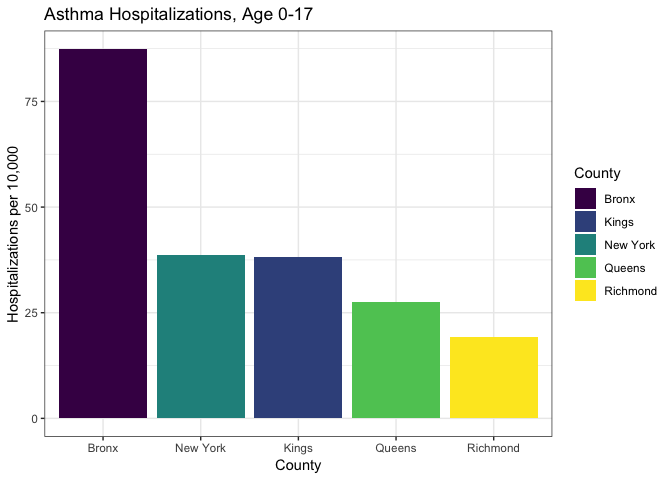

-   Asthma Emergency Department Visits in NYC, 2014

``` r
asthma_hosp_nyc %>%
  ggplot(aes(x = reorder(county_name, -asthma_hosp_percent_rate_ratio), 
             y = asthma_hosp_percent_rate_ratio)) +
  labs(
    title = "Asthma Emergency Department Visits",
    x = "County",
    y = "Hospitalizations per 10,000") +
  geom_histogram(stat = "identity", aes(fill = county_name)) + 
  viridis::scale_fill_viridis(name = "County", discrete = TRUE) +
  theme_bw()
```

    ## Warning: Ignoring unknown parameters: binwidth, bins, pad

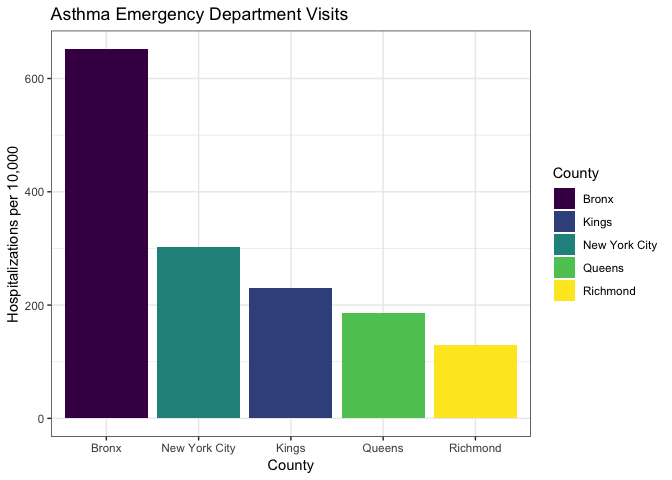

-   Asthma ER Admissions per County, 2014

``` r
asthma_ER_2014 %>%
    ggplot(aes(x = reorder(county, -asthma_ER_percent_rate), 
               y = asthma_ER_percent_rate, group = 1)) + 
  geom_histogram(stat = "identity") + 
  theme(axis.text.x = element_text(angle = 90)) + 
  labs(x = "County", y = "Asthma ER Admission Rate (per 10,000)", 
       title = "Asthma Emergency Room (ER) Admission Rate (per 10,000) by County in New York State, 2014") +
  theme_bw() +
  theme(axis.text.x = element_text(angle = 90), legend.position = "none")
```

    ## Warning: Ignoring unknown parameters: binwidth, bins, pad

    ## Warning: Removed 1 rows containing missing values (position_stack).

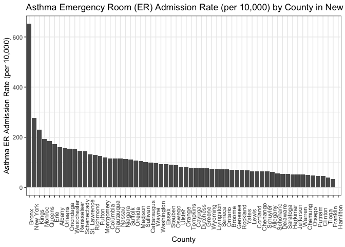

### CVD

-   Age-Adjusted CVD Hospitalization Rate in NYC, 2012 - 2014

``` r
cvd_data_NYS %>%
  filter(county_name %in% c("Bronx", "Kings", "New York", "Queens", 
                            "Richmond")) %>% 
  ggplot(aes(x = reorder(county_name, -percent_rate), y = percent_rate)) +
  labs(
    title = "CVD Hospitalization Rate",
    x = "County",
    y = "Hospitalizations per 10,000") +
  geom_histogram(stat = "identity", aes(fill = county_name)) + 
  viridis::scale_fill_viridis(name = "County", discrete = TRUE) +
  theme_bw()
```

    ## Warning: Ignoring unknown parameters: binwidth, bins, pad

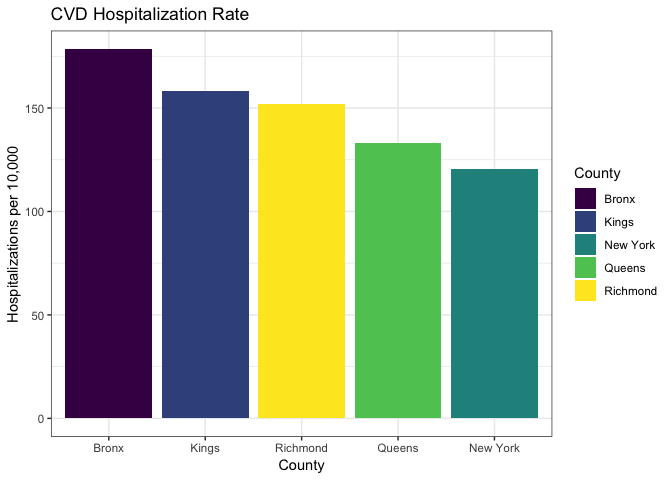

-   Age-Adjusted CVD Hospitalization Rate in NY State, 2012 - 2014

``` r
cvd_data_NYS %>%
  ggplot(aes(x = reorder(county_name, -percent_rate), y = percent_rate)) +
  labs(
    title = "CVD Hospitalization Rate in NY State, 2012 - 2014",
    x = "County",
    y = "Hospitalizations per 10,000") +
  geom_histogram(stat = "identity") + 
  theme_bw() +
  theme(axis.text.x = element_text(angle = 90), legend.position = "none")
```

    ## Warning: Ignoring unknown parameters: binwidth, bins, pad

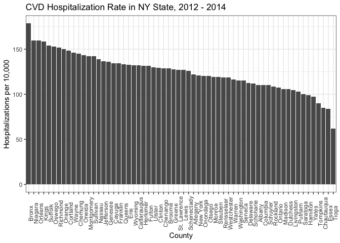

PM2.5
-----

-   PM2.5 (ug/m3), 2000-2014

``` r
PM_county_NYS %>%
  filter(measure == "Micrograms/cubic meter (LC)") %>%
  group_by(county, year) %>%
  ggplot(aes(x = year, y = output, color = county)) + 
  geom_line() + 
  labs(title = "Ambient PM2.5 Concentrations in New York State, 2000-2014", 
       x = "Year", 
       y = "PM2.5 (ug/m3)") +
  theme_bw()
```

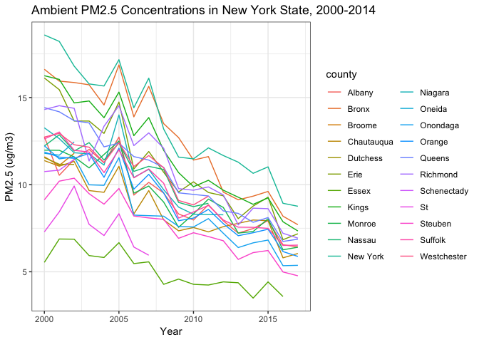

-   PM2.5 (person days) over time, 2000-2014

``` r
PM_county_NYS %>%
  filter(measure == "Person Days") %>%
  group_by(county, year) %>%
  ggplot(aes(x = year, y = output, color = county)) + 
  geom_line() + 
  labs(title = "Time at Risk for Ambient PM2.5 Exposure in New York State, 2000-2014", 
       x = "Year",
       y = "PM2.5 (person days)") +
  theme_bw()
```

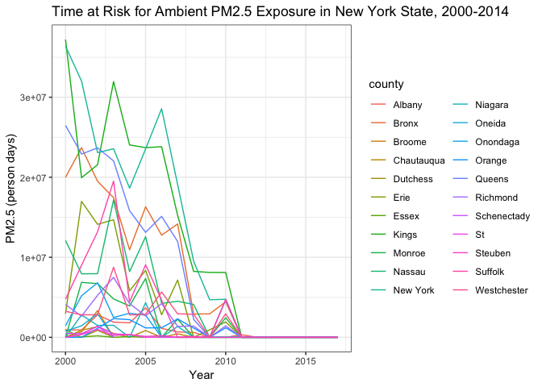

-   PM2.5 per county, 2014

``` r
PM_county_NYS %>%
  filter(measure == "Micrograms/cubic meter (LC)") %>%
  filter(year == "2014") %>%
  group_by(county) %>%
  ggplot(aes(x = reorder(county, -output), y = output, group = 1)) + 
  geom_histogram(stat = "identity") + 
  labs(title = "Ambient PM2.5 Concentrations in New York State, 2014", 
       x = "County", 
       y = "PM2.5 (ug/m3)") + 
  theme_bw() +
  theme(axis.text.x = element_text(angle = 90))
```

    ## Warning: Ignoring unknown parameters: binwidth, bins, pad

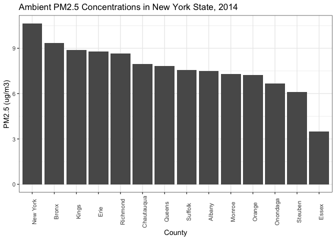

### Ozone

-   Ozone, 2000-2014

``` r
ozone_county_NYS %>%
  filter(measure == "Person Days") %>%
  group_by(county, year) %>%
  ggplot(aes(x = year, y = output, color = county)) + 
  geom_line() + 
  labs(title = "Time at Risk of Ambient Ozone Exposure in New York State, 2000-2014", 
       x = "Year", 
       y = "Ozone (person days)") +
  theme_bw()
```

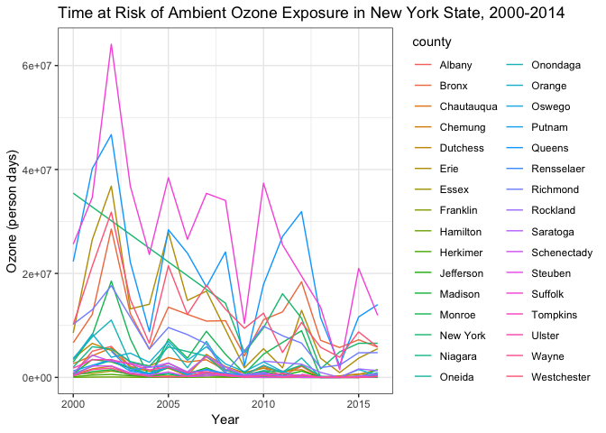

-   Ozone per county, 2014

``` r
ozone_county_NYS %>%
  filter(measure == "Person Days") %>%
  filter(year == "2014") %>%
  group_by(county) %>%
  ggplot(aes(x = reorder(county, -output), y = output, group = 1)) + 
  geom_histogram(stat = "identity") + 
  labs(title = "Time at Risk of Ambient Ozone Exposure in New York State, 2014", 
       x = "County", 
       y = "Ozone (person days)") + 
  theme_bw() +
  theme(axis.text.x = element_text(angle = 90))
```

    ## Warning: Ignoring unknown parameters: binwidth, bins, pad

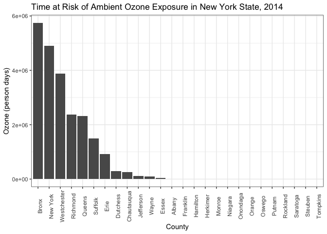

### Plots for Analysis

-   Asthma & PM2.5, 2014

``` r
joined %>% 
  filter(PM_unit == "Micrograms/cubic meter (LC)") %>%
  group_by(county) %>%
  ggplot(aes(x = PM_reading, y = asthma_ER_percent_rate, color = county)) + 
  geom_point() + 
  labs(x = "Ambient PM2.5 (ug/m3)", 
       y = "Asthma ER Admission Rate (per 10,000)", 
       title = "Association between PM2.5 and Asthma Emergency Room (ER) Admissions in New York State, 2014") + 
  theme_bw()
```

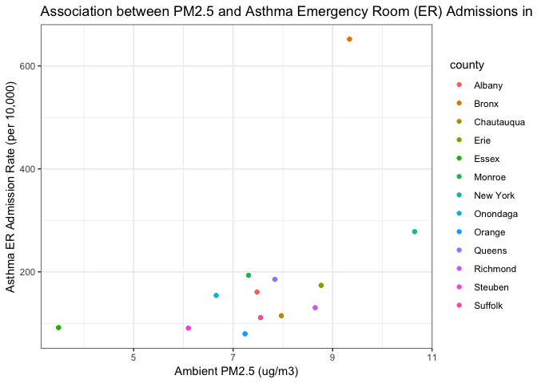

-   CVD & PM2.5, 2014

``` r
joined %>%  
  filter(PM_unit == "Micrograms/cubic meter (LC)") %>%
  group_by(county) %>%
  ggplot(aes(x = PM_reading, y = cvd_percent_rate, color = county)) + 
  geom_point() + 
  labs(x = "", 
       y = "", 
       title = "by County in New York State, 2014") + 
  labs(x = "Ambient PM2.5 (ug/m3)", 
       y = "CVD Hospital Visit Rate (per 10,000)", 
       title = "Association between PM2.5 and CVD Hospital Visits in New York State, 2014") +
  theme_bw()
```

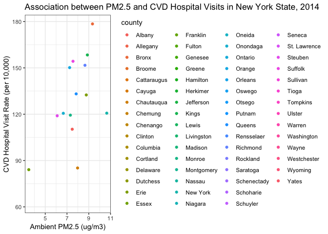

-   Asthma & Ozone, 2014

``` r
joined %>% 
  filter(ozone_unit == "Person Days") %>%
  group_by(county) %>%
  ggplot(aes(x = ozone_reading, y = asthma_ER_percent_rate, color = county)) + 
  geom_point() + 
  labs(x = "Ozone (person days)",
       y = "Asthma ER Admission Rate (per 10,000)", 
       title = "Association between Ozone and Asthma Emergency Room (ER) Admissions in New York State, 2014") +
  theme_bw()
```

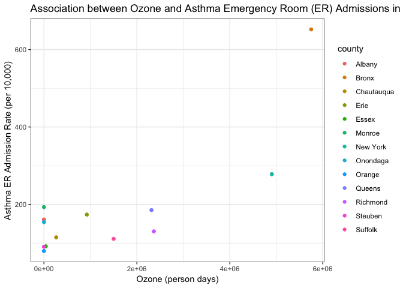

-   CVD & Ozone, 2014

``` r
joined %>%  
  filter(ozone_unit == "Person Days") %>%
  group_by(county) %>%
  ggplot(aes(x = ozone_reading, y = cvd_percent_rate, color = county)) +
  geom_point() + 
  labs(x = "Ozone (person days)", 
       y = "CVD Hospital Visit Rate (per 10,000)", 
       title = "Association between Ozone and CVD Hospital Visits in New York State, 2014") +
  theme_bw()
```

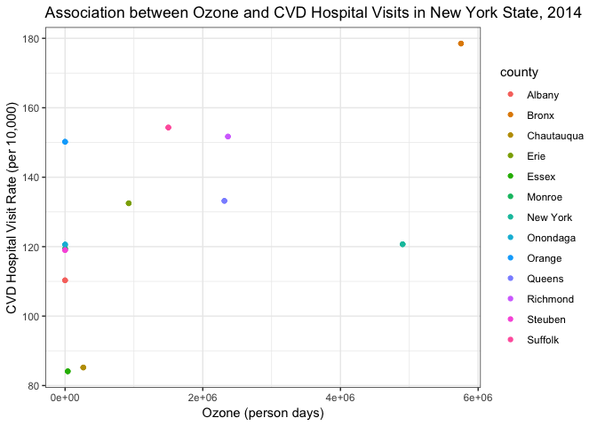
