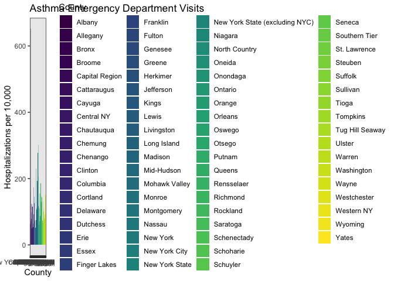
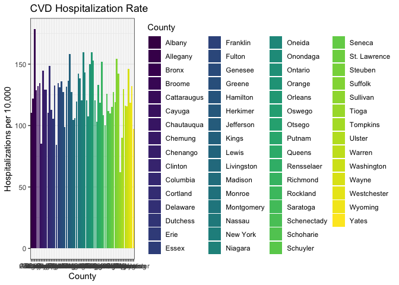
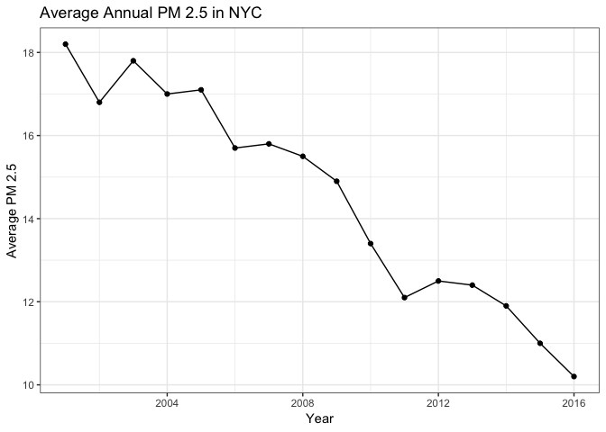

Ashley's Exploratory Data Analysis
================
Ashley Kang
11/20/2018

### Loading and cleaning data

1.  Annual Average of Fine Particulate Matter (PM 2.5) in NYC, 2001 - 2016

-   Data source: NYC DOHMH Environmental & Health Data

``` r
pollution_data = read_csv(file = "./data_AK/Trends_in_Fine_Particulate_Matter_Annual_Average.csv") %>% 
  janitor::clean_names() %>%
  select(x_value, y_value) %>% 
  rename(year = x_value, PM_2.5 = y_value)
```

1.  Asthma Emergency Department Visit Rate per 10,000 by County in NYC, 2014

-   Data source: NYSDOH Health Data

``` r
asthma_ed_data = read_csv(file = "./data_AK/PA__Asthma_Emergency_Department_Visit_Rate_Per_10_000_by_County__Latest_Year.csv") %>% 
  janitor::clean_names() %>%
  select(county_name, event_count_rate, average_number_of_denominator_rate, 
         percentage_rate_ratio) %>% 
  filter(county_name %in% c("Bronx", "Kings", "New York", "Queens", 
                            "Richmond"))
```

1.  Cardiovascular Disease Hospitalization Rate per 10,000 by County in NYC, 2012-2014

-   Data source: NYSDOH Health Data

``` r
cvd_data = read_csv(file = "./data_AK/Community_Health__Age-adjusted_Cardiovascular_Disease_Hospitalization_Rate_per_10_000_by_County_Map__Latest_Data.csv") %>% 
  janitor::clean_names() %>%
  filter(health_topic %in% "Cardiovascular Disease Indicators") %>% 
  select(county_name, event_count, average_number_of_denominator, 
         percent_rate) %>% 
  filter(county_name %in% c("Bronx", "Kings", "New York", "Queens", 
                            "Richmond"))
```

Note: Richmond County = Staten Island, Kings County = Brooklyn. We can rename from county to boroughs.

### Visualization of data

Asthma Emergency Department Visits in NYC, 2014

``` r
asthma_ed_data %>%
  ggplot(aes(x = county_name, y = percentage_rate_ratio)) +
  labs(
    title = "Asthma Emergency Department Visits",
    x = "County",
    y = "Hospitalizations per 10,000") +
  geom_histogram(stat = "identity", aes(fill = county_name)) + 
  viridis::scale_fill_viridis(name = "County", discrete = TRUE) +
  theme_bw()
```

    ## Warning: Ignoring unknown parameters: binwidth, bins, pad



Asthma emergency department visits are highest in Bronx (substantially higher than the next highest county which is New York), while Richmond County (Staten Island) reports the fewest asthma emergency department visits.

CVD Hospitalization Rate in NYC, 2012 - 2014

``` r
cvd_data %>%
  ggplot(aes(x = county_name, y = percent_rate)) +
  labs(
    title = "CVD Hospitalization Rate",
    x = "County",
    y = "Hospitalizations per 10,000") +
  geom_histogram(stat = "identity", aes(fill = county_name)) + 
  viridis::scale_fill_viridis(name = "County", discrete = TRUE) +
  theme_bw()
```

    ## Warning: Ignoring unknown parameters: binwidth, bins, pad



CVD hospitalizations are highest in Bronx, as well. However, the discrepency between the rate of CVD hospitalization in Bronx and Kings County (Brooklyn, which has the second highest rate) is not as extreme as it was for asthma emergency department visits. New York County reports the lowest rates of CVD hospitalization.

Average Annual PM 2.5 in NYC, 2001 - 2016

``` r
pollution_data %>% 
  ggplot(aes(x = year, y = PM_2.5)) +
  geom_point() +
  geom_line() + 
  labs(
    title = "Average Annual PM 2.5 in NYC",
    x = "Year",
    y = "Average PM 2.5") +
  theme_bw()
```



Average annual PM 2.5 recordings were highest in 2001 and has generally decreased as we reach 2016.
