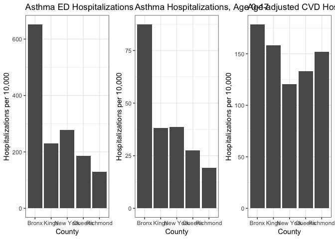
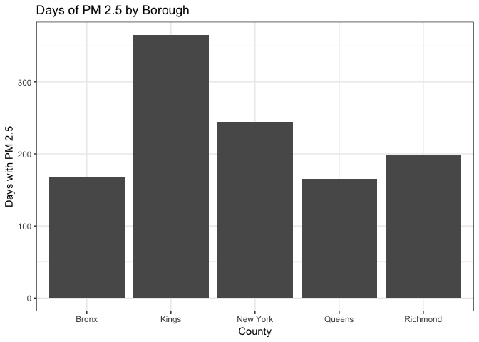
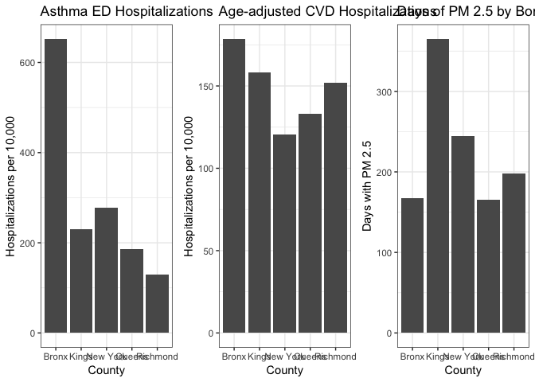

Anjile's Exploratory Data Analysis
================
Anjile An
Due November 25, 2018

### Read and clean data

``` r
# Asthma emergency department visit rate per 10,000 by county
# Source: NYSDOH Health Data NY
asthma_ed = read_csv(file = "./data_AA/asthma_ED_rate_10000.csv") %>% 
  janitor::clean_names() %>%
  filter(county_name %in% c("Bronx", "Kings", "Queens", "Richmond", "New York"))
```

    ## Parsed with column specification:
    ## cols(
    ##   .default = col_character(),
    ##   `Priority Area Number` = col_integer(),
    ##   `Focus Area Number` = col_integer(),
    ##   `Event Count/Rate` = col_integer(),
    ##   `Average Number of Denominator/Rate` = col_integer(),
    ##   `Percentage/Rate/Ratio` = col_double(),
    ##   `2018 Objective` = col_double(),
    ##   `Data Years` = col_integer()
    ## )

    ## See spec(...) for full column specifications.

``` r
# Asthma hospitalization rate per 10,000, ages 0-17 years by county
# Source: NYSDOH Health Data NY
asthma_hosp_017 = read_csv(file = "./data_AA/asthma_hospitalization_rate_10000_children.csv") %>%
  janitor::clean_names() %>%
  filter(county_name %in% c("Bronx", "Kings", "Queens", "Richmond", "New York")) %>%
  filter(health_topic_number == 13) # 3 and 13 give the same numbers, don't need the duplicate rows
```

    ## Parsed with column specification:
    ## cols(
    ##   `County Name` = col_character(),
    ##   `Health Topic Number` = col_integer(),
    ##   `Health Topic` = col_character(),
    ##   `Indicator Number` = col_character(),
    ##   Indicator = col_character(),
    ##   `Event Count` = col_integer(),
    ##   `Average Number of Denominator` = col_integer(),
    ##   `Measure Unit` = col_character(),
    ##   `Percent/Rate` = col_double(),
    ##   `Lower Limit of 95% CI` = col_character(),
    ##   `Upper Limit of 95% CI` = col_character(),
    ##   `Data Comments` = col_character(),
    ##   Quartile = col_character(),
    ##   `Data Years` = col_character(),
    ##   `Data Source` = col_character(),
    ##   `Mapping Distribution` = col_integer(),
    ##   Location = col_character()
    ## )

``` r
# Age-adjusted cardiovascular disease hospitalization rate per 10,000 by county
# Source: NYSDOH Health Data NY
cvd_hosp = read_csv(file = "./data_AA/ageadjusted_cvd_hospitalization_rate_10000.csv") %>%
  janitor::clean_names() %>%
  filter(county_name %in% c("Bronx", "Kings", "Queens", "Richmond", "New York")) %>%
  filter(health_topic_number == 2) # also had duplicate row for CVD indicators and obesity indicators
```

    ## Parsed with column specification:
    ## cols(
    ##   `County Name` = col_character(),
    ##   `Health Topic Number` = col_integer(),
    ##   `Health Topic` = col_character(),
    ##   `Indicator Number` = col_character(),
    ##   Indicator = col_character(),
    ##   `Event Count` = col_integer(),
    ##   `Average Number of Denominator` = col_integer(),
    ##   `Measure Unit` = col_character(),
    ##   `Percent/Rate` = col_double(),
    ##   `Lower Limit of 95% CI` = col_character(),
    ##   `Upper Limit of 95% CI` = col_character(),
    ##   `Data Comments` = col_character(),
    ##   Quartile = col_character(),
    ##   `Data Years` = col_character(),
    ##   `Data Source` = col_character(),
    ##   `Mapping Distribution` = col_integer(),
    ##   Location = col_character()
    ## )

``` r
# NYC fine particulate matter (PM 2.5) annual averages, 2001-2016
# Source: NYCDOH EH Portal
nyc_pm25_trends = read_csv(file = "./data_AA/nyc_fine_particulate_matter.csv") %>% janitor::clean_names()
```

    ## Parsed with column specification:
    ## cols(
    ##   Year = col_integer(),
    ##   PM2.5 = col_double()
    ## )

``` r
# PM2.5 annual summary data by county
# Source: US EPA AQS
nyc_pm25 = read_csv(file = "./data_AA/annual_aqi_by_county_2014.csv") %>% 
  janitor::clean_names() %>%
  filter(state == "New York") %>%
  filter(county %in% c("Bronx", "Kings", "Queens", "Richmond", "New York"))
```

    ## Parsed with column specification:
    ## cols(
    ##   State = col_character(),
    ##   County = col_character(),
    ##   Year = col_integer(),
    ##   `Days with AQI` = col_integer(),
    ##   `Good Days` = col_integer(),
    ##   `Moderate Days` = col_integer(),
    ##   `Unhealthy for Sensitive Groups Days` = col_integer(),
    ##   `Unhealthy Days` = col_integer(),
    ##   `Very Unhealthy Days` = col_integer(),
    ##   `Hazardous Days` = col_integer(),
    ##   `Max AQI` = col_integer(),
    ##   `90th Percentile AQI` = col_integer(),
    ##   `Median AQI` = col_integer(),
    ##   `Days CO` = col_integer(),
    ##   `Days NO2` = col_integer(),
    ##   `Days Ozone` = col_integer(),
    ##   `Days SO2` = col_integer(),
    ##   `Days PM2.5` = col_integer(),
    ##   `Days PM10` = col_integer()
    ## )

`asthma_ed` data years is only 2014, where as `asthma_hosp_017` and `cvd_hosp` use 2012-2014 data. The `nyc_pm25_trends` data has 2001-2016 yearly average, which may not be that useful for our purposes, since we are limited by year. Read and cleaned US EPA AQS data for 2014 in NYC instead, since it has borough-level data which is more consistent with the rest of our data.

Considerations:

-   Rename "Kings" to Brooklyn, "Richmond" to Staten Island, and "New York" to Manhattan? (County names vs. borough names)

-   How to include the PM 2.5?

### Exploratory data analysis

``` r
# Asthma emergency department visit rate per 10,000 by county
asthma_ed_hist = asthma_ed %>%
  ggplot(aes(x = county_name, y = percentage_rate_ratio, group = 1)) +
  labs(
    title = "Asthma ED Hospitalizations",
    x = "County",
    y = "Hospitalizations per 10,000") +
  geom_histogram(stat = "identity")
```

    ## Warning: Ignoring unknown parameters: binwidth, bins, pad

``` r
# Asthma hospitalization rate per 10,000, ages 0-17 years by county
asthma_hosp_hist = asthma_hosp_017 %>%
  ggplot(aes(x = county_name, y = percent_rate, group = 1)) +
  labs(
    title = "Asthma Hospitalizations, Age 0-17",
    x = "County",
    y = "Hospitalizations per 10,000") +
  geom_histogram(stat = "identity")
```

    ## Warning: Ignoring unknown parameters: binwidth, bins, pad

``` r
# Age-adjusted cardiovascular disease hospitalization rate per 10,000 by county
cvd_hosp_hist = cvd_hosp %>%
  ggplot(aes(x = county_name, y = percent_rate, group = 1)) +
  labs(
    title = "Age-adjusted CVD Hospitalizations",
    x = "County",
    y = "Hospitalizations per 10,000") +
  geom_histogram(stat = "identity")
```

    ## Warning: Ignoring unknown parameters: binwidth, bins, pad

``` r
# For colour: geom_histogram(stat = "identity", aes(fill = day))

asthma_ed_hist + asthma_hosp_hist + cvd_hosp_hist
```



It makes sense that asthma ED hospitalizations and asthma hospitalizations among children are similar (Bronx county with a huge spike), but the addition of the adult population seems to decrease Kings/Brooklyn's rate. While Bronx still has the highest, the trends for CVD hospitalizations are very different, with New York/Manhattan being the lowest instead of second highest. Richmond/Staten Island appears to have a large increase.

``` r
pm_hist = nyc_pm25 %>%
  ggplot(aes(x = county, y = days_pm2_5)) + 
  labs(
    title = "Days of PM 2.5 by Borough",
    x = "County",
    y = "Days with PM 2.5") +
  geom_histogram(stat = "identity")
```

    ## Warning: Ignoring unknown parameters: binwidth, bins, pad

``` r
pm_hist
```



Trends in of number of days of PM 2.5 does not appear to follow the same trends of hospitalizations ... interesting.

``` r
asthma_ed_hist + cvd_hosp_hist + pm_hist
```



#### Questions/considerations

-   Does number of hospitals have to do with anything? (Find data on number of hospitals per borough)

-   Standardize these ratios somehow to overlay them?
