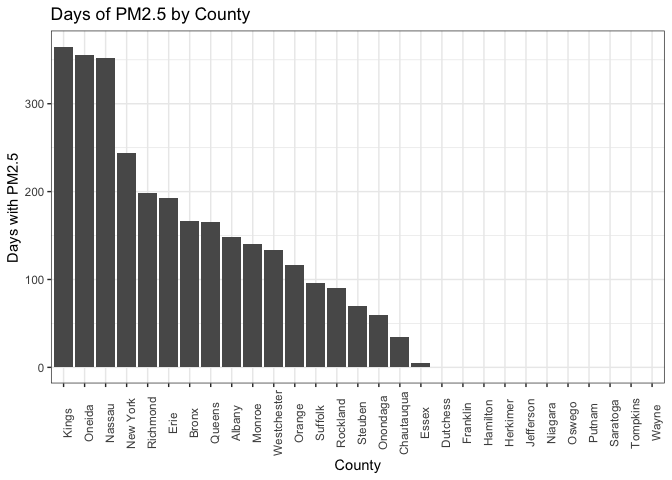
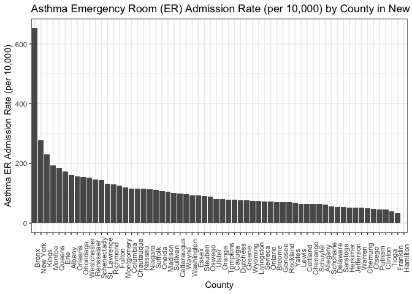
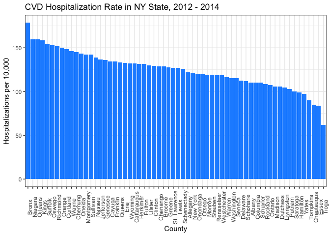

Final Project Report
================
Anjile An (ja3237), Ashley Kang (aik2136), Divya Bisht (db3180), Amelia Grant-Alfieri (ag3911)
Due December 6, 2018

Motivation
----------

Unlike many factors we can control in determining our health, ambient (outdoor) air quality is almost impossible to alter given its ubiquitous nature. Across the globe, it accounts for significant morbidity and, to a lesser degree, mortality. Indoor air pollution is also an important exposure pathway particularly for women and children who live in households that burn solid fuel for cooking and heating. For this project, we focused on ambient air quality because there is more available data and because indoor air pollution is less widespread in the United States and New York State than in other places around the world.

When someone breathes, they are exposed not to a single compound in isolation but rather to a mixture of compounds. Two compounds that are known to confer toxicity are ozone and fine particulate matter (PM2.5). Ozone is a fat soluble chemical than can bypass absorption in the upper respiratory system and penetrate down into the alveoli. PM2.5 is a tiny particle that, due to its size, can also travel deep into the alveoli. Both PM2.5 and ozone can have harmful local effects in the respiratory system and, because of their ability to cross from the lung into the bloodstream, can have harmful distal effects throughout the cardiovascular system.

We were interested in how air pollution in New York State, measured through proxies such as PM2.5, ozone and air quality index (AQI), may lead to the acute exacerbation of chronic conditions like cardiovascular diseases and asthma as well as acute cardiovascular symptoms. Our goal is to illustrate trends in the relationship between air quality and acute health outcomes and areas (geographically and scientifically) requiring future research.

Related work
------------

*Anything that inspired you, such as a paper, a web site, or something we discussed in class.*

Research conducted by Dr. Frederica Perera, Dr. Marianthi-Anna Kioumourtzoglou, and others at the Center for Children's Environmental Health, Columbia University, as well as previous classwork utilizing NOAA data inspired us to explore environmental data. Throughout our studies, we have learned that air pollution is known to have detrimental effects on human health. For instance, [high PM2.5](https://www.ncbi.nlm.nih.gov/pmc/articles/PMC5260007/) and [ozone exposure](https://www.atsjournals.org/doi/abs/10.1164/rccm.201811-2106ED) causes damage to the respiratory system, which puts individuals at risk for health outcomes like asthma and heart disease. We became personally interested about how air quality here may adversely affect our health outcomes upon learning that New York ranks tenth in [most polluted cities (by ozone)](https://www.lung.org/our-initiatives/healthy-air/sota/city-rankings/most-polluted-cities.html) in the United States.

Initial questions
-----------------

*What questions are you trying to answer? How did these questions evolve over the course of the project? What new questions did you consider in the course of your analysis?*

Unlike many factors we can control in determining our health, ambient (outdoor) air quality is almost impossible to alter given its ubiquitous nature. Across the globe, it accounts for significant morbidity and, to a lesser degree, mortality. Indoor air pollution is also an important exposure pathway particularly for women and children who live in households that burn solid fuel for cooking and heating. For this project, we focused on ambient air quality because there is more available data and because indoor air pollution is less widespread in the United States and New York State than in other places around the world.

When someone breathes, they are exposed not to a single compound in isolation but rather to a mixture of compounds. Two compounds that are known to confer toxicity are ozone and fine particulate matter (PM2.5). Ozone is a fat soluble chemical than can bypass absorption in the upper respiratory system and penetrate down into the alveoli. PM2.5 is a tiny particle that, due to its size, can also travel deep into the alveoli. Both PM2.5 and ozone can have harmful local effects in the respiratory system and, because of their ability to cross from the lung into the bloodstream, can have harmful distal effects throughout the cardiovascular system.

We were interested in how air pollution in New York State, measured through proxies such as PM2.5, ozone and air quality index (AQI), may lead to the acute exacerbation of chronic conditions like cardiovascular diseases and asthma as well as acute cardiovascular symptoms. Our goal is to illustrate trends in the relationship between air quality and acute health outcomes and areas (geographically and scientifically) requiring future research.

Data
----

*Source, scraping method, cleaning, etc - Anjile*

For our data analysis, we used data from [New York State DOH HealthData](https://data.ny.gov/browse?category=Health&utf8=%E2%9C%93), [NYCDOH Environment and Health Data Portal](http://a816-dohbesp.nyc.gov/IndicatorPublic/publictracking.aspx), [United States Environmental Protection Agency AirData](https://www.epa.gov/outdoor-air-quality-data).

[Asthma emergency department visits, rate per 10,000 by county](https://health.data.ny.gov/Health/PA-Asthma-Emergency-Department-Visit-Rate-Per-10-0/4xmh-bgkz). \* We noticed right away that this dataset only had data from 2014, which became an important factor in selecting future datasets to use in our analysis. \* The data, while we initially thought was presented by county, we found also included NYS regions (ie. New York City) which we removed in our cleaning process.

[Age-adjusted cardiovascular disease hospitalization, rate per 10,000 by county](https://health.data.ny.gov/Health/Community-Health-Age-adjusted-Cardiovascular-Disea/3ycx-tfnb) \* This was the most complete dataset on CVD, and matched the data years of the asthma dataset (2012-2014). \* This dataset was doubled in size because of the two “health topics” that cardiovascular disease fell under, resulting in two rows of identical data for each county. We selected for the “cardiovascular disease indicator” health topic, and removed NYS regions in the cleaning process as well.

[PM 2.5 by NYS county](https://apps.health.ny.gov/statistics/environmental/public_health_tracking/tracker/index.html#/airpollutionExportData) \* This dataset had PM 2.5 by county data for 2000 - 2017, but the data was very incomplete, with only 13 out of 62 counties reporting measures. \* We selected for 2014, to match our outcome data. \* PM 2.5 was also measured in a variety of ways for the 13 counties, including ug/m^3, percent, and person-days, which is not standard across available datasets.

[Ozone by NYS county](https://apps.health.ny.gov/statistics/environmental/public_health_tracking/tracker/index.html#/airpollutionExportData) \* This dataset had ozone by county data for 2000 - 2016, but the data was very also incomplete as with the PM 2.5 data, with only 26 out of 62 counties reporting measures. \* We selected for 2014, to match our outcome data. \* Ozone was measured in days and person-days, which is also different from the PM 2.5 reporting.

[Annual summary air quality index data by county, 2014](https://aqs.epa.gov/aqsweb/airdata/download_files.html#Annual) \* This dataset provided county level air quality index (0-500 scale) data for 2014, and we selected for New York State, but only 29 counties had available data. \* The data listed the number of good to hazardous air quality index days for each county, and the sum of total unhealthy days (unhealthy for sensitive groups or worse). \* The dataset also listed how many days out of the year each county measured for a series of pollutants, but we chose to use total unhealthy days as an aggregate measure of air quality.

[NYS, hospitals per county](https://profiles.health.ny.gov/hospital/county_or_region/) \* There was no readily available dataset for number of hospitals per county, so we had to manually use the NYS Health Profiles to create a dataset with the number of hospitals per county.

Exploratory analysis
--------------------

Background & Objectives
-----------------------

### Exploration

Initial PM2.5 data exploration was focused on New York City counties. However, limited data was available available, so NY state county data were selected to demonstrate the relationship between PM2.5 and hospitalizations of asthma and CVD.

Over 2000-2014, levels of PM2.5 across all counties in New York State have steadily decreased.

#### PM2.5 Dataset, 2000-2014

``` r
PM_county_NYS = read_csv("PM2.5_county_NYS.csv") %>%
  janitor::clean_names() %>%
  #filter(year == "2014") %>%
  select(county_name, year, output, measure) %>%
  separate(county_name, into = c("county", "delete", sep = " ")) %>% 
  select(-delete) %>%
  mutate(county = recode(county, `New` = "New York"))
## Warning: Expected 3 pieces. Missing pieces filled with `NA` in 882 rows [1,
## 2, 3, 4, 5, 6, 7, 8, 9, 10, 12, 13, 14, 15, 16, 17, 18, 19, 20, 21, ...].
  #how to remove NA column?
```

#### Plot PM2.5 (ug/m3) over time, 2000-2014

``` r
PM_plot_conc_allyears = PM_county_NYS %>%
  filter(measure == "Micrograms/cubic meter (LC)") %>%
  group_by(county, year) %>%
  ggplot(aes(x = year, y = output, color = county)) + geom_line() + labs(title = "Ambient PM2.5 Concentrations in New York State, 2000-2014", x = "Year", y = "PM2.5 (ug/m3)")
PM_plot_conc_allyears
```


Next, we wanted to assess how PM2.5 exposure varied across counties in NY State.

#### PM2.5 EPA dataset

``` r
nyc_pm25 = read_csv(file = "./data_AA/annual_aqi_by_county_2014.csv") %>% 
  janitor::clean_names() %>%
  filter(state == "New York")
## Parsed with column specification:
## cols(
##   .default = col_integer(),
##   State = col_character(),
##   County = col_character()
## )
## See spec(...) for full column specifications.
```

#### Days of PM2.5 by NY County

``` r
pm_hist = nyc_pm25 %>%
  ggplot(aes(x = county, y = days_pm2_5)) + 
  labs(
    title = "Days of PM2.5 by Borough",
    x = "County",
    y = "Days with PM2.5") +
  geom_histogram(stat = "identity") + theme(axis.text.x = element_text(angle = 90))
## Warning: Ignoring unknown parameters: binwidth, bins, pad

pm_hist
```



Literature shows that exposure to PM2.5 is associated with asthma and cardiovascular disease. Therefore, we wanted to assess hospitalization of asthma and CVD across counties.

#### Asthma ER Admissions Rate Dataset, 2014

``` r
asthma_ER = read_csv("Asthma_ER_Rate_10000.csv") %>%
  janitor::clean_names() %>%
  #filter(county_name == "Bronx" | county_name == "Kings" | county_name == "Queens" | county_name == "Richmond" | county_name == "New York") %>%
  select(county_name, percentage_rate_ratio, data_years) %>%
  rename(asthma_ER_percent_rate = percentage_rate_ratio, 
         asthma_ER_years = data_years) %>%
  filter(county_name != "Long Island" & county_name != "New York City" & county_name != "Mid-Hudson" & county_name != "Capital Region" & county_name != "Mohawk Valley" & county_name != "North Country" & county_name != "Tug Hill Seaway" & county_name != "Central NY" & county_name != "Southern Tier" & county_name != "Finger Lakes" & county_name != "Western NY" & county_name != "New York State (excluding NYC)" & county_name != "New York State") %>% #to remove non-county regions
  rename(county = county_name)
```

#### Plot Asthma ER Admissions per County, 2014

``` r
asthma_plot_14 = asthma_ER %>%
    ggplot(aes(x = reorder(county, -asthma_ER_percent_rate), y = asthma_ER_percent_rate, group = 1)) + geom_histogram(stat = "identity") + theme(axis.text.x = element_text(angle = 90)) + labs(x = "County", y = "Asthma ER Admission Rate (per 10,000)", title = "Asthma Emergency Room (ER) Admission Rate (per 10,000) by County in New York State, 2014")
## Warning: Ignoring unknown parameters: binwidth, bins, pad
asthma_plot_14 
## Warning: Removed 1 rows containing missing values (position_stack).
```



#### Cardiovascular hospitalizations

``` r
cvd_data = read_csv(file = "./data_AK/Community_Health__Age-adjusted_Cardiovascular_Disease_Hospitalization_Rate_per_10_000_by_County_Map__Latest_Data.csv") %>% 
  janitor::clean_names() %>%
  filter(health_topic %in% "Cardiovascular Disease Indicators") %>% 
  select(county_name, event_count, average_number_of_denominator, 
         percent_rate)
```

#### Age-Adjusted CVD Hospitalization Rate in NY State, 2012 - 2014

``` r
cvd_data %>%
  ggplot(aes(x = reorder(county_name, -percent_rate), y = percent_rate)) +
  labs(
    title = "CVD Hospitalization Rate in NY State, 2012 - 2014",
    x = "County",
    y = "Hospitalizations per 10,000") +
  geom_histogram(stat = "identity") + 
  theme_bw() +
  theme(axis.text.x = element_text(angle = 90), legend.position = "none")
## Warning: Ignoring unknown parameters: binwidth, bins, pad
```



======= *Visualizations, summaries, and exploratory statistical analyses. Justify the steps you took, and show any major changes to your ideas.* - Ashley, Div &gt;&gt;&gt;&gt;&gt;&gt;&gt; 86c08e47f37f82e7b6e7eb038c1fd090dfe96998

Additional analysis
-------------------

*If you undertake formal statistical analyses, describe these in detail.* - Model building - Looked at associations, trends

Discussion
----------

*What were your findings? Are they what you expect? What insights into the data can you make?*

Asthma is chronic disease so asthma emergency room visit rates reflect asthma exacerbation incidents. In contrast, cardiovascular hospitalization rates do not differentiate between a one-time acute episode like a stroke or an exacerbation of an underlying cardiovascular condition like high blood pressure or arrhythmia.

Limitation - So many things in air, mixtures, hard to get data on/complicated to analyze. Include in future models. -CVD is 2012-2014, asthma is just 2014

It is critical to note that poor communities are more susceptible to the potential life-threatening, acute effects of air pollution because they are more likely to have chronic diseases like asthma and heart disease and are more likely to live in more highly contaminated neighborhoods.
