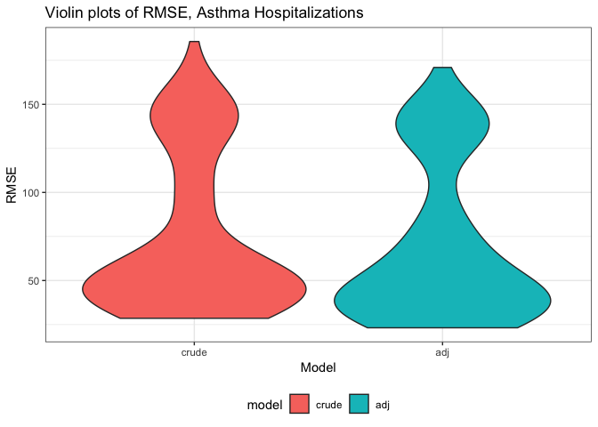
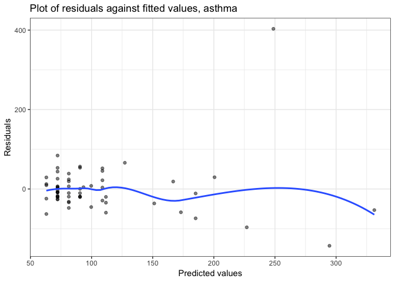
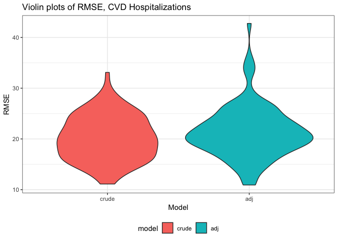
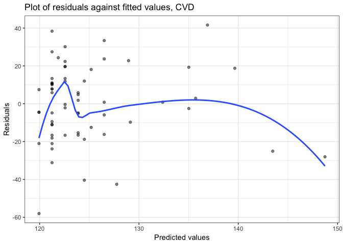

Model Building
================
Anjile An
December 4, 2018

Load and clean data
-------------------

To build our model, we are looking at New York State asthma hospitalizations data, CVD hospitalizations data, and PM2.5 (air quality) data. In our exploratory analysis, we found that the trends of hospitalizations and PM2.5 do not trend together, and a potential confounder to that may be the number of hospitals in each county.

``` r
# Asthma emergency department visit rate per 10,000 by county
# Source: NYSDOH Health Data NY
# remove "regions"

asthma_ed = read_csv(file = "./data_AA/asthma_ED_rate_10000.csv") %>% 
  janitor::clean_names() %>%
  select(county_name, event_count_rate, percentage_rate_ratio, data_years) %>%
  filter(!county_name %in% c("Capital Region", "Central NY", "Finger Lakes", "Long Island", "Mid-Hudson", "Mohawk Valley", "New York City", "New York State", "New York State (excluding NYC)", "North Country", "Southern Tier", "Tug Hill Seaway", "Western NY")) %>% 
  rename(asthma_hosp_percent_rate_ratio = percentage_rate_ratio, 
         asthma_event_count = event_count_rate,
         asthma_hosp_years = data_years,
         county = county_name)
```

``` r
# Age-adjusted cardiovascular disease hospitalization rate per 10,000 by county
# Source: NYSDOH Health Data NY
# remove "regions"

cvd_hosp = read_csv(file = "./data_AA/ageadjusted_cvd_hospitalization_rate_10000.csv") %>%
  janitor::clean_names() %>%
  filter(health_topic == "Cardiovascular Disease Indicators") %>%
  filter(!county_name %in% c("Capital Region", "Central NY", "Finger Lakes", "Long Island", "Mid-Hudson", "Mohawk Valley", "New York City", "New York State", "New York State (excluding NYC)", "North Country", "Southern Tier", "Tug Hill Seaway", "Western NY")) %>% 
  select(county_name, event_count, percent_rate, data_years) %>%
  rename(county = county_name,
         cvd_event_count = event_count,
         cvd_percent_rate = percent_rate,
         cvd_data_years = data_years)
```

``` r
# PM 2.5 annual summary data by county
# Source: US EPA AQS, 2014

nys_pm25 = read_csv(file = "./data_AA/annual_aqi_by_county_2014.csv") %>% 
  janitor::clean_names() %>%
  filter(state == "New York") %>%
  select(county, good_days:median_aqi) %>%
  rename(airq_good_days = good_days,
         airq_moderate_days = moderate_days,
         airq_unhealthy_for_sensitive_groups_days = unhealthy_for_sensitive_groups_days,
         airq_unhealthy_days = unhealthy_days,
         airq_very_unhealthy_days = very_unhealthy_days,
         airq_hazardous_days = hazardous_days)
```

``` r
# NYS county population and number of hospitals
# Source: NYS HealthData, 2014

num_hosp = read_csv(file = "./data_AA/nys_county_hospitals_2014.csv") %>% 
  janitor::clean_names() %>%
  rename(county = geography) %>%
  mutate(county = str_replace(county, " County", "")) %>%
  select(county, population, number_of_hospitals)
```

Joining the data:

``` r
asthma_cvd_join = full_join(asthma_ed, cvd_hosp, by = "county")
pm25_numhosp_join = full_join(nys_pm25, num_hosp, by = "county")

nys_joined = left_join(asthma_cvd_join, pm25_numhosp_join, by = "county")

# change NAs to 0 for ease of regression analysis
nys_joined[is.na(nys_joined)] = 0
```

**Checks before regression analysis:**

``` r
# Check for missing data

sum(is.na(asthma_ed)) 
## [1] 2
sum(is.na(cvd_hosp))
## [1] 0
sum(is.na(nys_pm25))
## [1] 0
sum(is.na(num_hosp))
## [1] 0
```

There are 2 pieces of missing data in `asthma_ed` file under Hamilton county, which could be a data entry error or due to the fact that Hamilton county has a very small population (4703) and none were hospitalized for asthma.

Visual checks were done in previous exploratory analysis.

Regression model
----------------

We will test two models each for asthma hospitalizations and CVD hospitalizations - the crude model and the adjusted model (including number of hospitals as a covariate).

Crude model:

> asthma = unhealthy\_aqi

> cvd = unhealthy\_aqi

Adjusted model:

> asthma = unhealthy\_aqi + num\_hosp

> cvd = unhealthy\_aqi + num\_hosp

Interaction is not included, as it makes interpretation difficult.

#### Asthma model

``` r
# Crude asthma model
crude_asthma_model = lm(asthma_hosp_percent_rate_ratio ~ total_unhealthy_days, data = nys_joined)

# Adjusted asthma model
adj_asthma_model = lm(asthma_hosp_percent_rate_ratio ~ total_unhealthy_days + number_of_hospitals, data = nys_joined)
```

#### CVD model

``` r
# Crude cvd model
crude_cvd_model = lm(cvd_percent_rate ~ total_unhealthy_days, data = nys_joined)

# Adjusted cvd model
adj_cvd_model = lm(cvd_percent_rate ~ total_unhealthy_days + number_of_hospitals, data = nys_joined)
```

Cross validation
----------------

#### Asthma model

``` r
set.seed(1)
cv_asthma = crossv_mc(nys_joined, 100) 

# Fit candidate models
options(warn = -1) # suppress printing all the warnings
cv_asthma = cv_asthma %>%
  mutate(crude_asthma_mod = map(train, ~lm(asthma_hosp_percent_rate_ratio ~ total_unhealthy_days, data = .x)),
         adj_asthma_mod = map(train, ~lm(asthma_hosp_percent_rate_ratio ~ total_unhealthy_days + number_of_hospitals, data = .x))) %>%
  mutate(rmse_crude = map2_dbl(crude_asthma_mod, test, ~rmse(model = .x, data = .y)),
         rmse_adj = map2_dbl(adj_asthma_mod, test, ~rmse(model = .x, data = .y)))

# Plot distribution of RMSE
cv_asthma %>% 
  select(starts_with("rmse")) %>% 
  gather(key = model, value = rmse) %>% 
  mutate(model = str_replace(model, "rmse_", ""),
         model = fct_inorder(model)) %>% 
  ggplot(aes(x = model, y = rmse, fill = model)) + 
  labs(
    title = "Violin plots of RMSE, Asthma Hospitalizations",
    y = "RMSE",
    x = "Model"
  ) +
  geom_violin()
```



#### Diagnostics of adjusted asthma model

``` r
# Plotting residuals
nys_joined %>%
  add_residuals(adj_asthma_model) %>%
  add_predictions(adj_asthma_model) %>%
  ggplot(aes(x = pred, y = resid)) + 
  labs(
    title = "Plot of residuals against fitted values",
    x = "Predicted values",
    y = "Residuals"
  ) +
  geom_point(alpha = .5) + 
  geom_smooth(se = FALSE)
## `geom_smooth()` using method = 'loess' and formula 'y ~ x'
```



The plot of the residuals illustrates that the model does not predict higher values very well, which makes sense given that the rate of asthma hospitalizations events is generally not very high, save for select counties in NYC. The values cluster in the lower end of the distribution, and the fitted line jumps around, maybe in large part due to the small number of counties.

#### CVD model

``` r
set.seed(1)
cv_cvd = crossv_mc(nys_joined, 100) 

# Fit candidate models
options(warn = -1) # suppress printing all the warnings
cv_cvd = cv_cvd %>%
  mutate(crude_cvd_mod = map(train, ~lm(cvd_percent_rate ~ total_unhealthy_days, data = .x)),
         adj_cvd_mod = map(train, ~lm(cvd_percent_rate ~ total_unhealthy_days + number_of_hospitals, data = .x))) %>%
  mutate(rmse_crude = map2_dbl(crude_cvd_mod, test, ~rmse(model = .x, data = .y)),
         rmse_adj = map2_dbl(adj_cvd_mod, test, ~rmse(model = .x, data = .y)))

# Plot distribution of RMSE
cv_cvd %>% 
  select(starts_with("rmse")) %>% 
  gather(key = model, value = rmse) %>% 
  mutate(model = str_replace(model, "rmse_", ""),
         model = fct_inorder(model)) %>% 
  ggplot(aes(x = model, y = rmse, fill = model)) + 
  labs(
    title = "Violin plots of RMSE, CVD Hospitalizations",
    y = "RMSE",
    x = "Model"
  ) +
  geom_violin()
```



#### Diagnostics of adjusted CVD model

``` r
# Plotting residuals
nys_joined %>%
  add_residuals(adj_cvd_model) %>%
  add_predictions(adj_cvd_model) %>%
  ggplot(aes(x = pred, y = resid)) + 
  labs(
    title = "Plot of residuals against fitted values",
    x = "Predicted values",
    y = "Residuals"
  ) +
  geom_point(alpha = .5) + 
  geom_smooth(se = FALSE)
## `geom_smooth()` using method = 'loess' and formula 'y ~ x'
```



The plot of the residuals for the adjusted CVD hospitalizations model shows that the residuals are widely distributed for the lower predicted values, and has similar issues to the asthma hospitalizations plot in that the small sample size pulling the fitted line.

Final models
------------

``` r
# Adjusted asthma model
adj_asthma_model = lm(asthma_hosp_percent_rate_ratio ~ total_unhealthy_days + number_of_hospitals, data = nys_joined)
summary(adj_asthma_model)
## 
## Call:
## lm(formula = asthma_hosp_percent_rate_ratio ~ total_unhealthy_days + 
##     number_of_hospitals, data = nys_joined)
## 
## Residuals:
##     Min      1Q  Median      3Q     Max 
## -143.08  -25.36   -8.35   19.10  403.28 
## 
## Coefficients:
##                      Estimate Std. Error t value Pr(>|t|)    
## (Intercept)            63.033     11.203   5.627 5.34e-07 ***
## total_unhealthy_days   21.204      8.780   2.415 0.018847 *  
## number_of_hospitals     9.170      2.452   3.740 0.000419 ***
## ---
## Signif. codes:  0 '***' 0.001 '**' 0.01 '*' 0.05 '.' 0.1 ' ' 1
## 
## Residual standard error: 66.47 on 59 degrees of freedom
## Multiple R-squared:  0.424,  Adjusted R-squared:  0.4044 
## F-statistic: 21.71 on 2 and 59 DF,  p-value: 8.579e-08
# summary(crude_asthma_model)

# Adjusted CVD model
adj_cvd_model = lm(cvd_percent_rate ~ total_unhealthy_days + number_of_hospitals, data = nys_joined)
summary(adj_cvd_model)
## 
## Call:
## lm(formula = cvd_percent_rate ~ total_unhealthy_days + number_of_hospitals, 
##     data = nys_joined)
## 
## Residuals:
##    Min     1Q Median     3Q    Max 
## -58.03 -14.66   0.80  13.00  41.60 
## 
## Coefficients:
##                      Estimate Std. Error t value Pr(>|t|)    
## (Intercept)          119.9347     3.4517  34.747   <2e-16 ***
## total_unhealthy_days   0.6267     2.7051   0.232   0.8176    
## number_of_hospitals    1.3145     0.7555   1.740   0.0871 .  
## ---
## Signif. codes:  0 '***' 0.001 '**' 0.01 '*' 0.05 '.' 0.1 ' ' 1
## 
## Residual standard error: 20.48 on 59 degrees of freedom
## Multiple R-squared:  0.07996,    Adjusted R-squared:  0.04877 
## F-statistic: 2.564 on 2 and 59 DF,  p-value: 0.08556
# summary(crude_cvd_model)
```

In our final adjusted asthma model, we see that the adjusted R-squared value is 0.4044 (compared to 0.2755 for the crude model), with a statistically significant p-value of 8.579e-08 (compared to 7.099e-06 for the crude model). This indicates a moderately well fitting model for asthma and air quality, but could still benefit from the addition of other predictors.

In our final adjusted CVD model, we see that the adjusted R-squared value is 0.0488 (compared to 0.0166 for the crude model), with a statistically insignificant p-value of 0.08556 (compared to 0.1592 for the crude model). This indicates that the while the adjusted model is better than the crude, it is still not a good model in predicting the effects of air quality on CVD hospitalizations in New York State.
